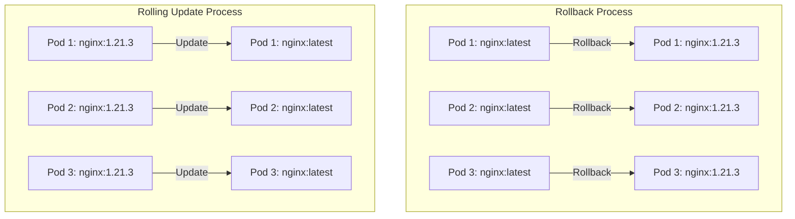

# ☸ Kubernetes Rolling Updates & Rollbacks Implementation

[](https://github.com/TheToriqul/k8s-rolling-updates)


## 📋 Project Overview

This project showcases my implementation of zero-downtime deployment strategies using Kubernetes rolling updates and rollbacks. Through this work, I've developed practical expertise in managing containerized applications, ensuring continuous service availability, and implementing robust recovery mechanisms. The project demonstrates my ability to handle production-grade deployment scenarios while maintaining system reliability.

## 🎯 Key Objectives

- Implement zero-downtime application updates using Kubernetes rolling updates
- Master container versioning and deployment management
- Establish reliable rollback procedures for quick recovery
- Develop monitoring and verification workflows
- Create reproducible deployment processes
- Gain hands-on experience with enterprise-grade deployment strategies

## 🏗️ Project Architecture
The architecture implements sequential pod updates in Kubernetes, where three NGINX pods are gradually updated from version 1.21.3 to the latest version, ensuring zero-downtime by updating one pod at a time. If needed, the system supports rollback functionality, allowing pods to revert to their previous version (1.21.3) using the same sequential process to maintain continuous service availability.


## 💻 Technical Stack

- Frontend: NGINX Web Server
- Container: Docker
- Orchestration: Kubernetes
- DevOps: kubectl, Shell Scripting
- Version Control: Git

## 🚀 Getting Started

<details>
<summary>🐳 Prerequisites</summary>

- Kubernetes cluster (local or cloud)
- kubectl CLI tool
- Docker runtime
- Basic Kubernetes knowledge
- Git

</details>

<details>
<summary>⚙️ Installation</summary>

1. Clone the repository:
   ```bash
   git clone https://github.com/TheToriqul/k8s-rolling-updates.git
   ```
2. Navigate to the project directory:
   ```bash
   cd k8s-rolling-updates
   ```
3. Apply deployment configuration:
   ```bash
   kubectl apply -f deployment.yaml
   ```

</details>

<details>
<summary>🎮 Usage</summary>

1. Create initial deployment:
   ```bash
   kubectl apply -f deployment.yaml
   ```
2. Verify deployment status:
   ```bash
   kubectl get deployments
   kubectl get pods
   ```
3. Perform rolling update:
   ```bash
   kubectl set image deployment/nginx-deployment nginx=nginx:latest
   ```

For detailed commands and explanations, refer to the [reference-commands.md](reference-commands.md) file.
</details>

## 💡 Key Learnings

### Technical Mastery:
1. Kubernetes deployment strategies
2. Zero-downtime update processes
3. Container orchestration
4. Deployment versioning
5. Rolling update mechanisms

### Professional Development:
1. Production deployment management
2. System reliability engineering
3. Technical documentation
4. Problem-solving in distributed systems
5. DevOps best practices

## 🔄 Future Enhancements

<details>
<summary>View Planned Improvements</summary>

1. Implement automated health checks
2. Add custom metrics for deployment monitoring
3. Integrate with CI/CD pipeline
4. Deploy multiple environment configurations
5. Add automated testing framework
6. Implement canary deployments

</details>

## 🙌 Contribution

Contributions are welcome! Feel free to [open an issue](https://github.com/TheToriqul/k8s-rolling-updates/issues) or submit a [pull request](https://github.com/TheToriqul/k8s-rolling-updates/pulls) to suggest improvements or add features.

## 📧 Connect with Me

- 📧 Email: toriqul.int@gmail.com
- 📱 Phone: +65 8936 7705, +8801765 939006
- 🌐 LinkedIn: [@TheToriqul](https://www.linkedin.com/in/thetoriqul/)
- 🐙 GitHub: [@TheToriqul](https://github.com/TheToriqul)
- 🌍 Portfolio: [TheToriqul.com](https://thetoriqul.com)

Let's connect and discuss all things beyond!

## 👏 Acknowledgments

- [Poridhi for providing comprehensive labs and inspiring this project](https://devops.poridhi.io/)
- Kubernetes community for excellent documentation
- NGINX team for reliable container images
- Docker community for container runtime excellence
- Open source community for continuous inspiration

---

Thank you for visiting this repository and joining me on this exciting learning journey. I hope you find the project insightful and valuable. Happy deploying! 🚀